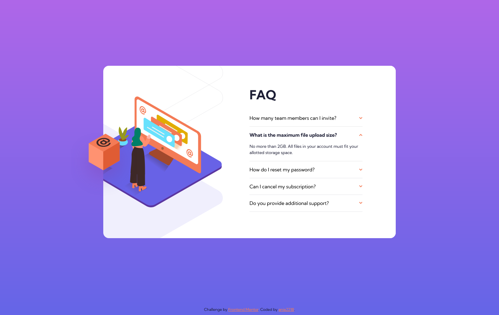

# Frontend Mentor - FAQ accordion card solution

This is a solution to the [FAQ accordion card challenge on Frontend Mentor](https://www.frontendmentor.io/challenges/faq-accordion-card-XlyjD0Oam). Frontend Mentor challenges help you improve your coding skills by building realistic projects.

## Table of contents

- [Overview](#overview)
  - [The challenge](#the-challenge)
  - [Screenshot](#screenshot)
  - [Links](#links)
- [My process](#my-process)
  - [Built with](#built-with)
  - [What I learned](#what-i-learned)
  - [Continued development](#continued-development)
  - [Useful resources](#useful-resources)
- [Author](#author)

## Overview

### The challenge

Users should be able to:

- View the optimal layout for the component depending on their device's screen size
- See hover states for all interactive elements on the page
- Hide/Show the answer to a question when the question is clicked

### Screenshot

### Links

- Solution URL: [GitHub](https://github.com/ania221B/faq-accordion-card)
- Live Site URL: [GitHub Pages](https://ania221b.github.io/faq-accordion-card/)

## My process

### Built with

- Semantic HTML5 markup
- CSS custom properties
- Flexbox
- CSS Grid
- Mobile-first workflow
- Vanilla JS

### What I learned

To use `background-position-x` and `background-position-y` to change the way a baclground image looks.

### Continued development

- JavaScript in general
- Writing functions in JavaScript

### Useful resources

- [background-position-y o MDN](https://developer.mozilla.org/en-US/docs/Web/CSS/background-position-y) - This is one of the 2 articles that helped me with getting the background as similar to the design as I could
- [background-position-x on MDN](https://developer.mozilla.org/en-US/docs/Web/CSS/background-position-x) - Second article that helped me with the background image

## Author

- Frontend Mentor - [@ania221B](https://www.frontendmentor.io/profile/ania221B)
